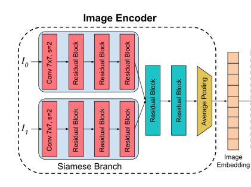

# eos_multiview_pose

Online and offline multiview pose estimation

## Getting started

The code mainly consists of 3 main parts:
- **Data** -  Loading data consists of **left frame** and **right frame** along with **gt relative pose** for 1) Algolux captures (Real) 2) CARLA Stereo capture (Synthetic). 
    - This is handled using dataloaders - [`stereopose_dataset.py`](src/dataset/stereopose_dataset.py) and [`carlastereo_dataset.py`](src/dataset/carlastereo_dataset.py).
    - data is arranged using JSON files, which essentially contains path(or subpath) of left and right frame. Look for csv files in [Algolux](src/data/split_files/algolux) and [CARLA](src/data/split_files/carla) 

- **Network Architecture** - Currently, two network architectures have been tried: 
    - Pose Network from Monodepth2 which uses two frame concatenation across channels, loacted under [pose_cnn.py](src/model/pose_cnn.py).
    - Substrcture from Pose Estimation Network from [Wide-Baseline Relative Camera Pose Estimation with Directional Learning](https://arxiv.org/pdf/2106.03336.pdf) which look something like this:

        
    
    located under [Siamese Pose Network](src/model/siamese_pose.py).

    This network uses siamese architecture to extract features from both images separately.
- **Loss Function** - Loss function is defined in these lines mainly [loss](/src/trainer.py#L233-L326)

## Training
To start training with CARLA, run the following command:
```sh
bash src/experiments/carla/exp-7.sh
```
You can look at other experiments by changing the `exp-` number.
