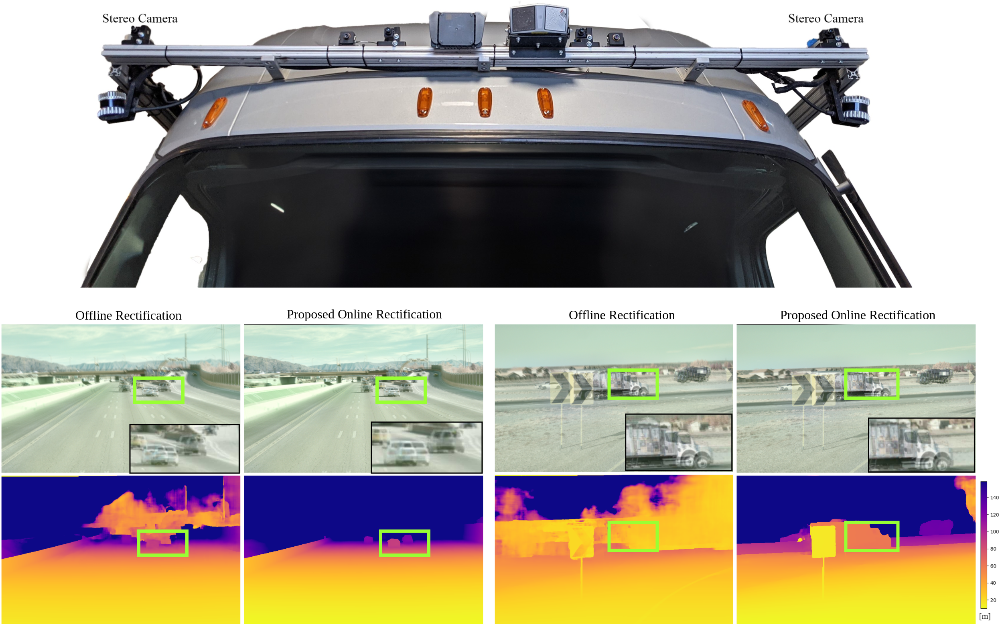
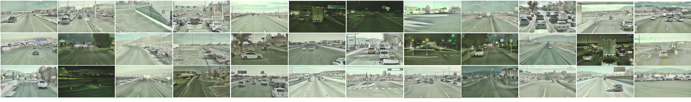
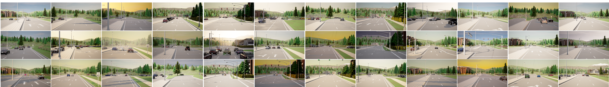

# Flow-Guided Online Stereo Rectification for Wide Baseline Stereo

Official Implementation of our CVPR 2024 paper

[**Flow-Guided Online Stereo Rectification for Wide Baseline Stereo**](https://openaccess.thecvf.com/content/CVPR2024/papers/Kumar_Flow-Guided_Online_Stereo_Rectification_for_Wide_Baseline_Stereo_CVPR_2024_paper.pdf) | [**Website**](https://light.princeton.edu/publication/online-stereo-recification/)



## Install Dependencies

```shell
pip install -r requirements.txt
```

## Public Datasets

- **[Semi-Truck Highway Dataset](https://torc-public-data-sharing.s3.amazonaws.com/index.html?prefix=stereo-rectification-datasets/semi-truck-highway/)**
  - _Real world semi-truck captures with natural de-calibration of stereo cameras_


- **[Carla Dataset](https://torclec-public-data-sharing.s3.amazonaws.com/index.html?prefix=stereo-rectification-datasets/carla-dataset/)**
  - _Synthetic captures with manual perturbations introduced to simulate extreme de-calibration_


- **[KITTI](https://drive.google.com/file/d/1fWZTpLVOCJwuB9juETW1sgEELBqUO8Qv/view?usp=sharing)** (_ONLY train/test splits_)

## Pretrained Models

- [_Semi-Truck Highway Model_](https://drive.google.com/file/d/1i6R3ZLSRhyQwnPjSw7r4TIeMAHgdIu7s/view?usp=drive_link)
- [_Carla Model_](https://drive.google.com/file/d/1gVhbcs9maOlFOMWv1MyxPrkZ2-5P55TK/view?usp=drive_link)
- [_KITTI Model_](https://drive.google.com/file/d/17sB8l_B9V11eQSczG8I6e0K4GR5WHiNZ/view?usp=drive_link)

## Constructing an experiment script for Training/Evaluation

Please take a look at [**options.py**](src/options.py) for training/eval options or ablation and system level options.

<details>
<summary><i>Annotated example config used for Carla Data</summary>

```shell
 #!/bin/sh
 export CUDA_VISIBLE_DEVICES=0,1
 python src/train.py \
  --dataset carla \ # To use dataloader corresponding to dataset
  --data_dir /path/to/parent/dataset_folder/ \
  --gt_dir /path/to/parent/dataset_folder/camera_poses/ \
  --splits_dir /path/to/parent/dataset_folder/splits/ \
  --log_dir /path/to/log_directory/ \ # To log metrics and models
  --height 512 \
  --width 1024 \
  --exp_num 99 \ # Exp metadata for logging
  --exp_name training \ # Exp metadata for logging
  --exp_metainfo carla \ # Exp metadata for logging
  --batch_size 1 \ # Always use batch_size 1 when using --eval_mode. During training batch_size can be larger.
  --num_workers 12 \
  --pose_repr use_6D \ # Rotation representation to use
  --rotation 1e+02 \ # Weight on rotation loss
  --learning_rate 2e-05 \
  --model_name gmflow \ # Backbone model to use
  --num_epochs 160 \
  --algolux_test_res_opt_flow 0.5 \ # Resolution to compute Optical Flow loss (0.5x Input Res)
  --constrain_roi \
  --epoch_visual_loss 5 \ # Start Optical Flow loss (OF loss) after 5 epochs
  --use_radial_flow_mask \ # Prioritize pixels closer to the center of the imager for OF loss
  --resize_orig_img \
  --use_opt_flow_loss \ # Flag for OF loss
  --multi_gpu_opt_flow \ # Run OF model on different GPU if there are memory constraints, min 2 gpus needed
  --load_weights_folder /path/to/pretrained/weights \
  --eval_mode # Flag to only run inference on the weights provided (path to weights must be provided above)
 ```

</details>

## Training and Evaluation

```shell
bash src/experiemnts/<training/inference>/<exp>.sh
```

## TensorBoard Logging

The logs are stored in the location provied `--log_dir <path to logs>` in the respective `<exp>.sh` script. This is also the path where the checkpoints are saved after every epoch.

From inside the container to run tensorboard

```shell
tensorboard --logdir <path to logs> --port <custom-port>
```

This allows you to access tensorboard using the `localhost:custom-port`

## Folder Structure

`src/`

- `dataset/` contains all the dataloaders used for the respective datasets, written in pytorch.
- `experiments/`
  - `training/` contains all experiment configs for training.
  - `inference/` contains all experment configs for inference.
- `model/` contains the code for backbones and keypoint models.
  - `gmflow/` main backbone model used for the CVPR paper.
  - `hsmnet/` **Not** as performant as `gmflow` backbone.
  - `keypoint/` contains wrapper for `LOFTR` and implementation of `SuperGlue` which is important for reporting keypoint offset metrics.
- `utility/` contains the functions for logging, differentiable rectification and the optical flow loss wrapper.

## Reference

If you find our work useful in your research, please consider citing our paper:

```bibtex
  @inproceedings{Kumar_2024_CVPR,
      author    = {Kumar, Anush and Mannan, Fahim and Jafari, Omid Hosseini and Li, Shile and Heide, Felix},
      title     = {Flow-Guided Online Stereo Rectification for Wide Baseline Stereo},
      booktitle = {Proceedings of the IEEE/CVF Conference on Computer Vision and Pattern Recognition (CVPR)},
      month     = {June},
      year      = {2024},
      pages     = {15375-15385}
  }
```
